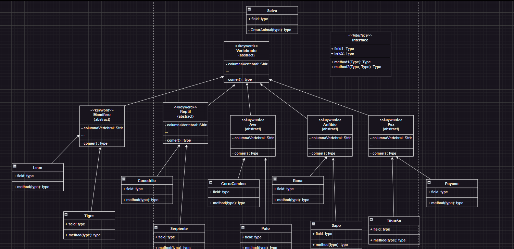

# Objetivo

Clasificar Animales de acorde a sus estructura osea y alimentacion, utilizando POO en java

## DIAGRAMA DE CLASES

Parte 1:

+ Se crea una clase Morthal que es el habitat donde viviran los animales.
+ Se crea la clase abstracta Vertebrado, porque no se deberian **Instanciar**, es decir, crear nuevos vertebrados ademas de los que existian en el planeta.
+ Debe existir las clases abstractas Mamifero, Reptil, Anfibio, Pez y Ave ya que estos son vertebrados.
+ De estas se deben heredar las características para cada animal que se va a crear, por ejemplo el Leon.

        Nota: El diagrama de clase se puede encontrar en el documento llamado DC_Jungle.drawio
